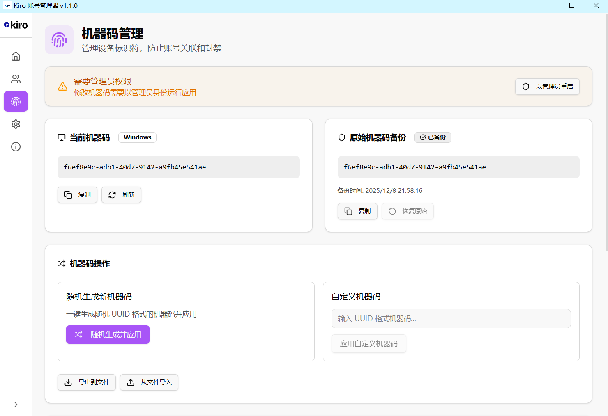
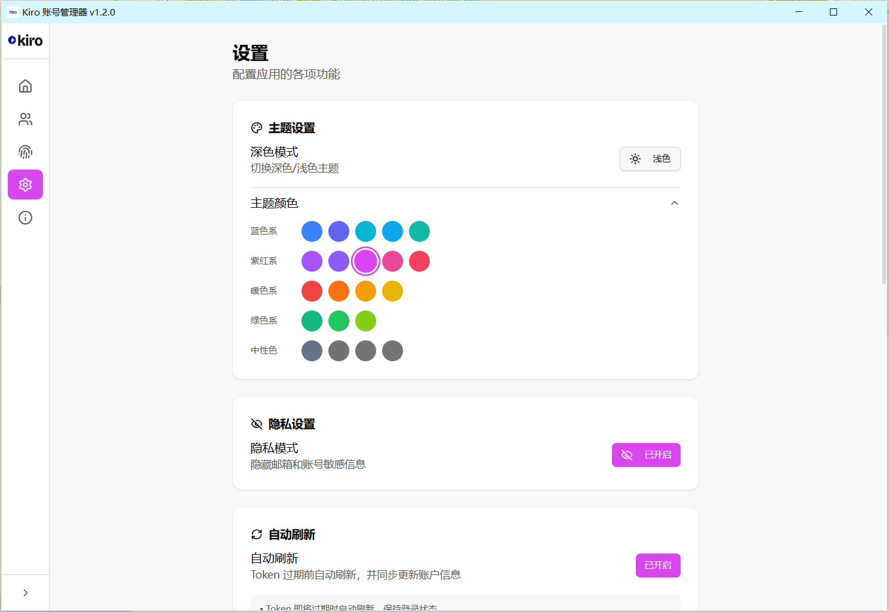

# Kiro Account Manager

<p align="center">
  
</p>

<p align="center">
  <strong>A powerful multi-account management tool for Kiro IDE</strong>
</p>

<p align="center">
  Quick account switching, auto token refresh, group/tag management, machine ID management and more
</p>

<p align="center">
  <strong>English</strong> | <a href="README_CN.md">简体中文</a>
</p>

---

## ✨ Features

### 🔐 Multi-Account Management
- Add, edit, and delete multiple Kiro accounts
- One-click quick account switching
- Support Builder ID and Social (Google/GitHub) login methods
- Batch import/export account data

### 🔄 Auto Refresh
- Auto refresh tokens before expiration
- Auto update account usage and subscription info after refresh
- Periodically check all account balances when auto-switch is enabled

### 📁 Groups & Tags
- Flexibly organize accounts with groups and tags
- Batch set groups/tags for multiple accounts

### 🔑 Machine ID Management
- Modify device identifier to prevent account association bans
- Auto switch machine ID when switching accounts
- Assign unique bound machine ID to each account

### 🔄 Auto Account Switch
- Auto switch to available account when balance is low
- Configurable balance threshold and check interval

### ⚙️ Kiro IDE Settings Sync
- Sync Kiro IDE settings (Agent mode, Model, MCP servers, etc.)
- Edit MCP server configurations
- Manage user rules (Steering files)

### 🌐 Multi-Language Support
- Full English/Chinese bilingual interface
- Auto-detect system language or manual selection

### 🎨 Personalization
- 21 theme colors available
- Dark/Light mode toggle
- Privacy mode to hide sensitive information

### 🌐 Proxy Support
- Support HTTP/HTTPS/SOCKS5 proxy

---

## 📸 Screenshots

### Home


### Account Management


### Machine ID Management


### Settings


### Kiro IDE Settings


### Theme Colors


### About


---

## 🛠️ Tech Stack

- **Frontend**: React 18 + TypeScript
- **Desktop**: Electron
- **State Management**: Zustand
- **UI Components**: Radix UI + Tailwind CSS
- **Icons**: Lucide React
- **Build Tool**: Vite

---

## 🚀 Development

```bash
# Install dependencies
npm install

# Start development server
npm run dev

# Build for production
npm run build

# Type check
npm run typecheck
```

---
