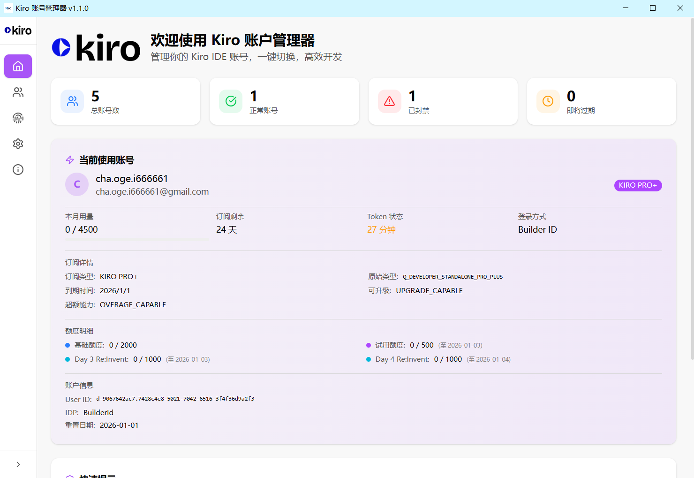
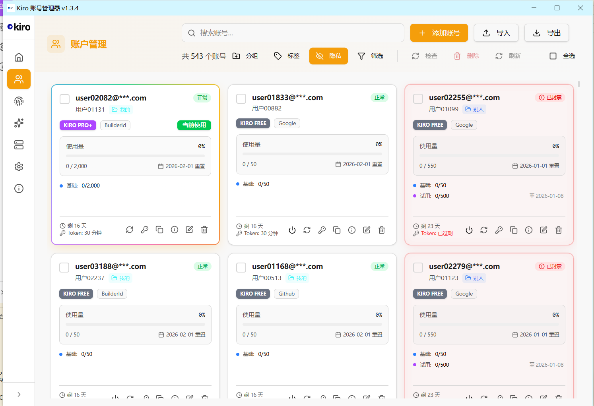
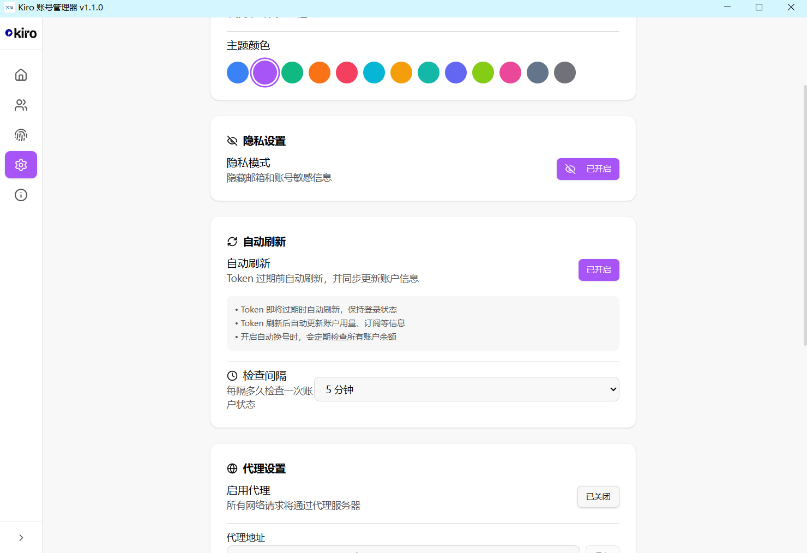
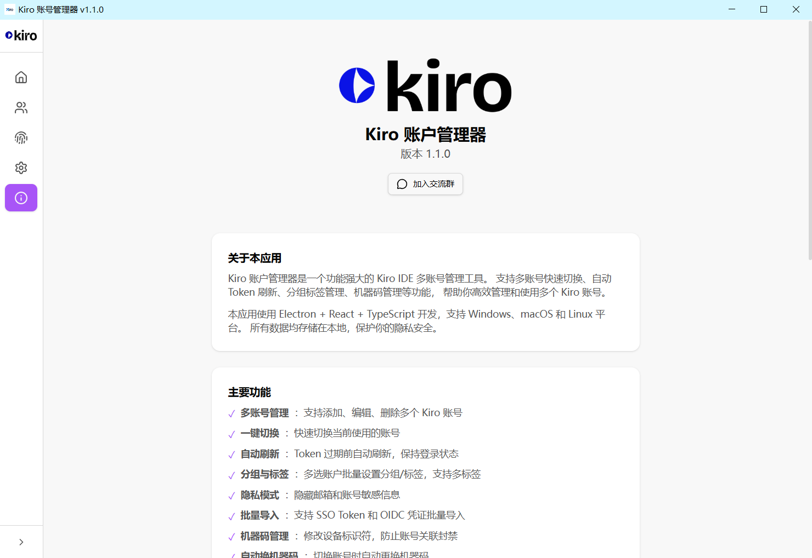

# Kiro 账户管理器

<p align="center">
  
</p>

<p align="center">
  <strong>一个功能强大的 Kiro IDE 多账号管理工具</strong>
</p>

<p align="center">
  支持多账号快速切换、自动 Token 刷新、分组标签管理、机器码管理等功能
</p>

<p align="center">
  <a href="README.md">English</a> | <strong>简体中文</strong>
</p>

---

## ✨ 功能特性

### 🔐 多账号管理
- 添加、编辑、删除多个 Kiro 账号
- 一键快速切换账号
- 支持 Builder ID 和社交登录（Google/GitHub）方式
- 批量导入/导出账号数据

### 🔄 自动刷新
- Token 过期前自动刷新
- 刷新后自动更新账号用量和订阅信息
- 开启自动切换后，定时检查所有账号余额

### 📁 分组与标签
- 使用分组和标签灵活组织账号
- 批量设置账号的分组/标签

### 🔑 机器码管理
- 修改设备标识符，防止账号关联封禁
- 切换账号时自动切换机器码
- 为每个账号分配唯一绑定的机器码

### 🔄 自动切换账号
- 余额不足时自动切换到可用账号
- 可配置余额阈值和检查间隔

### ⚙️ Kiro IDE 设置同步
- 同步 Kiro IDE 设置（Agent 模式、模型、MCP 服务器等）
- 编辑 MCP 服务器配置
- 管理用户规则（Steering 文件）

### 🌐 多语言支持
- 完整的中英文双语界面
- 自动检测系统语言或手动选择

### 🎨 个性化
- 21 种主题颜色可选
- 深色/浅色模式切换
- 隐私模式隐藏敏感信息

### 🌐 代理支持
- 支持 HTTP/HTTPS/SOCKS5 代理

---

## 📸 截图

### 主页


### 账户管理


### 设置


### 关于


---

## 🛠️ 技术栈

- **前端框架**: React 18 + TypeScript
- **桌面框架**: Electron
- **状态管理**: Zustand
- **UI 组件**: Radix UI + Tailwind CSS
- **图标库**: Lucide React
- **构建工具**: Vite

---

## 🚀 开发

```bash
# 安装依赖
npm install

# 启动开发服务器
npm run dev

# 构建生产版本
npm run build

# 类型检查
npm run typecheck
```

---

## 📋 更新日志

### v1.5.5

**Bug 修复:**
- 🧬 **OAuth 指纹自动生成**: 修复社交 OAuth 登录添加账号后未生成指纹的问题
- 🔄 **指纹流程统一**: 在验证与导入流程中统一返回指纹数据，覆盖 OAuth、SSO 和本地凭证导入
- 🗂️ **持久化一致性**: 单个导入与批量导入路径都会稳定保存 fingerprint 字段

完整说明见: `docs/CHANGELOG-v1.5.5.md`

### v1.5.2

**改进:**
- 🚀 **更好的用户体验**: 移除侵入性弹窗广告
- 🔗 **仅保留智能链接**: 保留用户友好的智能链接广告，支持可持续发展
- 🔒 **增强安全性**: 简化内容安全策略
- ⚡ **更好的性能**: 移除外部广告脚本，加载更快

**变更:**
- 移除弹窗广告集成
- 简化 CSP 规则，提高安全性
- 更简洁的界面，无弹窗干扰
- 通过可选的智能链接点击维持收入来源

### v1.5.1

**新功能:**
- 💰 **广告集成**: 弹窗和智能链接广告，支持可持续发展
- 🔧 **Better SQLite3 支持**: 修复原生模块集成，支持自动导入功能
- 🛡️ **增强 CSP**: 更新内容安全策略，兼容广告网络

**改进:**
- 优化广告加载，支持用户交互触发
- 改进脚本阻止时的错误处理
- 更简洁的关于页面界面

**Bug 修复:**
- 修复 better-sqlite3 模块加载错误
- 解决内容安全策略阻止问题
- 改进广告脚本加载可靠性

### v1.5.0

**新功能:**
- 🌐 **API 反代服务**: OpenAI 兼容的 API 网关，支持自动账号轮换
- 💬 **聊天界面**: 内置聊天功能，支持对话管理和 AI 智能标题生成
- 📊 **系统日志**: 实时日志流，支持颜色分级显示
- 📝 **API 示例**: 代码示例和 CC Switch 集成，快速配置
- 🎨 **现代化界面**: KiroaaS 风格设计，青柠色强调色，改进的深色模式

**改进:**
- 增强模型选择，支持所有 Kiro 原生模型
- 改进聊天和代理服务中的 API 密钥处理
- 更好的对话持久化，支持应用重启后恢复
- 更新仓库引用至 ProTechPh 组织

**Bug 修复:**
- 修复聊天完成中的 API 密钥认证问题
- 修复模型映射以保留原生 Kiro 模型
- 改进代理服务的错误处理

---

## 👨‍💻 作者

- **GitHub**: [chaogei](https://github.com/ProTechPh)
- **项目主页**: [Kiro-account-manager](https://github.com/ProTechPh/Kiro-account-manager)

---

## 📄 许可证

本项目采用 AGPL-3.0 许可证 - 详见 [LICENSE](LICENSE) 文件

---

## ⭐ Star 历史

如果这个项目对你有帮助，请给它一个 star ⭐
